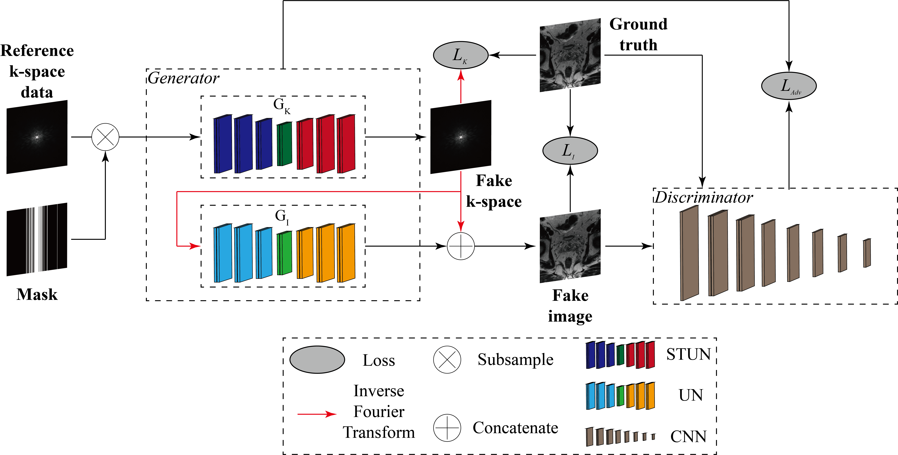

# SwinGAN

Official PyTorch implementation of SwinGAN described in the paper "Research on MRI reconstruction and K-space noise suppression using SwinGAN". Currently it is under review.

<div align="center">

</div>

## Dependencies

```
python>=3.6.9
torch>=1.7.1
torchvision>=0.8.2
cuda=>10.1
Pillow == 6.2.1
PyYAML == 5.3.1
h5py == 2.10.0
ipython == 6.0.0
matplotlib == 3.1.1
numpy == 1.17.3
scipy == 0.19.1
tqdm == 4.37.0
nibabel == 2.2.1
ninja
```

## Installation
- Clone this repo:
```bash
git clone https://github.com/notmayday/SwinGAN_brain-prostate
cd SwinGAN_brain-prostate
```

## Data
The data of this work is based on fastMRI T2 dataset for brain and prostate. It can be applied through [fastMRI](https://fastmri.med.nyu.edu/).
<br />

The raw [fastMRI](https://fastmri.med.nyu.edu/) H5 files necessitate pre-processing before further utilization. An illustrative example is provided within the pre-processing folder.

## Train
```
python3 train.py 
```


## Test
```
python3 difference_poisson.py 
```

## Trained checkpoint download

We have established two checkpoints based on our ongoing work. For optimal results, we recommend training your own SwinGAN model.
<br />
[Brain_T2_poisson_30%](https://drive.google.com/file/d/1tXT0GCe8CQoDE2vj5v5v8_QgS0wKpLzP/view?usp=drive_link)
<br />
[Prostate_T2_poisson_30%](https://drive.google.com/file/d/1bBSJblid7wjS7EA24NSKY_t8a5-x6VWy/view?usp=drive_link)

## Citation
```
You are encouraged to modify/distribute this code. However, please acknowledge this code and cite the paper appropriately.
```

## Acknowledgements
This code uses libraries from [Subsampled-Brain-MRI-Reconstruction-by-Generative-Adversarial-Neural-Networks](https://github.com/ItamarDavid/Subsampled-Brain-MRI-Reconstruction-by-Generative-Adversarial-Neural-Networks) and [SwinGAN](https://github.com/learnerzx/SwinGAN) repositories.
